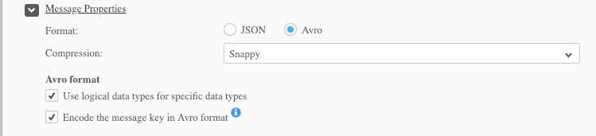
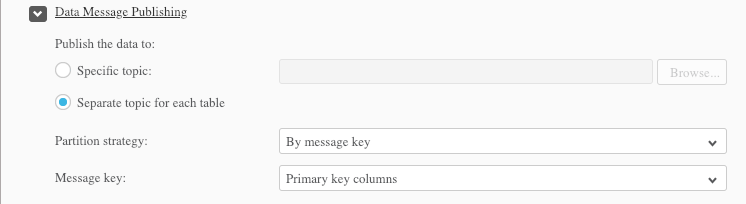
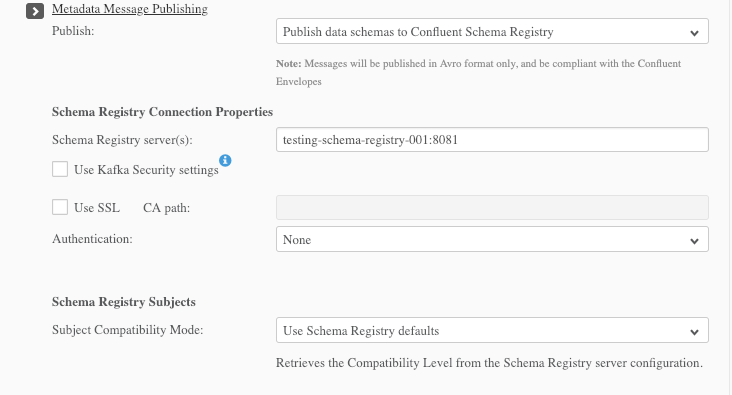

# Introduction

This project provides a transformation for data written to Kafka by Attunity Replicate. 

## Attunity Configuration

This was tested with Attunity Replicate version 6.3.0.312 with the following settings.





## Cassandra Example

```properties
name=sink
topics=employees.employees
tasks.max=1
connector.class=io.confluent.connect.cassandra.CassandraSinkConnector
cassandra.contact.points=cassandra
cassandra.keyspace=test
cassandra.compression=SNAPPY
cassandra.consistency.level=ANY
transforms=schema,fromreplicate
transforms.schema.type=org.apache.kafka.connect.transforms.RegexRouter
transforms.schema.regex=^(.+)\.(.+)$
transforms.schema.replacement=$2
transforms.fromreplicate.type=com.github.jcustenborder.kafka.connect.transform.common.FromReplicate
```
